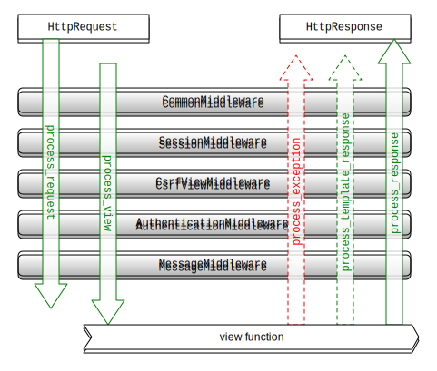

# 进阶部分

虽然是一个简单的Demo，但是有句老话叫：麻雀虽小五脏俱全，我们也得把常用的功能使用到。所以增加这一部分，包括：Class Base View, Middleware, TestCase这三个部分。

*注意*，如果你前面的例子没有跑起来，可以先不看这一节，先把前面的代码跑起来再说。不然，你可以能越学越乱。

## Class Based View

在如何阅读文档的部分，我又讲到，如果你有很多类似的view方法，那么你可以考虑抽象出一个ClassBased View来。这样可以更好的复用你的代码。

不过对于我们的需求来说，用ClassBased View不是很必要，我们只是演示用法。用类的方式有一个好处就是我们可以分离``get``和``post``的处理逻辑。回头看下上节``views.py``中的代码，其中有一个关于``request.method``的判断。我们来通过类级的View去掉层控制语句。

来看完整的views.py代码:

    # -*- coding: utf-8 -*-
    from __future__ import unicode_literals

    from django.http import HttpResponseRedirect
    from django.urls import reverse
    from django.shortcuts import render
    from django.views import View

    from .models import Student
    from .forms import StudentForm

	class IndexView(View):
		template_name = 'index.html'

		def get_context(self):
			students = Student.objects.all()
			context = {
				'students': students,
			}
			return context

		def get(self, request):
			context = self.get_context()
			form = StudentForm()
			context.update({
				'form': form
			})
			return render(request, self.template_name, context=context)

		def post(self, request):
			form = StudentForm(request.POST)
			if form.is_valid():
				cleaned_data = form.cleaned_data
				student = Student()
				student.name = cleaned_data['name']
				student.sex = cleaned_data['sex']
				student.email = cleaned_data['email']
				student.profession = cleaned_data['profession']
				student.qq = cleaned_data['qq']
				student.phone = cleaned_data['phone']
				student.save()
				return HttpResponseRedirect(reverse('index'))
			context = self.get_context()
			context.update({
				'form': form
			})
			return render(request, self.template_name, context=context)

你可能已经发现了，代码量突然变多了。本来一个函数可以解决的问题，现在却有了一个类，和多一个方法。对，这么做的道理就是让每一部分变的跟明确，比如``get``就是来处理get请求，``post``就是来处理post请求。维护的时候不需要像之前那样，所有的需求都去改一个函数。

理解了这么做的原因，我们来改下urls.py的定义，完整的代码如下:

    # coding:utf-8

    from django.conf.urls import url
    from django.contrib import admin

    from student.views import IndexView

    urlpatterns = [
        url(r'^$', IndexView.as_view(), name='index'),
        url(r'^admin/', admin.site.urls),
    ]

只是把之前的index改为了``IndexView.as_view()``，这个``as_view()``其实是对get和post方法的一个包装。里面做的事情，你可以简单的理解为我们上一节中自己写的判断``request.method``的逻辑。

## Middleware

这个需求中似乎没有需要用到Middleware的地方，不过我们可以生造一个，来练练手。

我们有这样一个需求，统计首页每次访问所消耗的时间，也就是wsgi接口或者socket接口接到请求，到最终返回的时间。先来创建一个middlewares.py的文件吧，在views.py的同级目录中。我们先来看下完整的代码：

    # coding:utf-8
    import time

    from django.utils.deprecation import MiddlewareMixin
    from django.urls import reverse

    class TimeItMiddleware(MiddlewareMixin):
        def process_request(self, request):
            return

        def process_view(self, request, func, *args, **kwargs):
            if request.path != reverse('index'):
                return None

            start = time.time()
            response = func(request)
            costed = time.time() - start
            print('{:.2f}s'.format(costed))
            return response

        def process_exception(self, request, exception):
            pass

        def process_template_response(self, request, response):
            return response

        def process_response(self, request, response):
            return response

上面的代码中列出了一个Middleware的完整接口，虽然我们只用到了``process_view``。下面我们来逐个了解下:

* ``process_request`` - 一个请求来到middelware层，进入的第一个方法。一般情况我们可以在这里做一些校验，比如用户登录，或者HTTP中是否有认证头之类的验证。这个方法需要两种返回值，HttpResponse或者None，如果返回HttpResponse，那么接下来的处理方法只会执行``process_response``，其他的方法将不会被执行。这里**需要注意的是**，如果你的middleware在settings配置的MIDDLEWARE_CLASS的第一个的话，那么剩下的middleware也不会被执行。另外一个返回值是None，如果返回None，那么Django会继续执行其他的方法。

* ``process_view`` - 这个方法是在``process_request``之后执行的，参数如上面代码所示，其中的func就是我们将要执行的view方法，因此我们要统计一个view的执行时间，可以在这里来做。它的返回值跟``process_request``一样，HttpResponse/None，逻辑也是一样。如果返回None，那么Django会帮你执行view函数，从而得到最终的Response。

* ``process_template_response`` - 执行完上面的方法，并且Django帮忙我们执行完view之后，拿到最终的response，如果是使用了模板的Response(是指通过``return render(request, 'index.html', context={})``的方式返回Response，就会来到这个方法中。这个方法中我们可以对response做一下操作，比如``Content-Type``设置，或者其他HEADER的修改/增加。

* ``process_response`` - 当所有流程都处理完毕，就来到了这个方法，这个方法的逻辑跟``process_template_response``是完全一样的。只是``process_template_response``是针对带有模板的response的处理。

* ``process_exception`` - 上面的所有处理方法是按顺序介绍的，而这个不太一样。只有在发生异常时，才会进入到这个方法。哪个阶段发生的异常呢？可以简单的理解为在将要调用的view中出现异常（就是在``process_view``的``func``函数中）或者返回的模板Response在render时发生的异常，会进入到这个方法中。但是**需要注意的是**，如果你在``process_view``中手动调用了``func``，就像我们上面做的那样，那就不会触发``process_exception``了。这个方法接收到异常之后，可以选择处理异常，然后返回一个含有异常信息的HttpResponse，或者直接返回None，不处理，这种情况Django会使用自己的异常模板。

这是一层Middleware中所有方法的执行顺序和说明，那么如果有多个Middleware配置，执行顺序应该是怎样的呢？我们可以通过下面的一个图来理解下。

## TestCase

单元测试是实际开发中，很重要，但是经常被忽视的部分。原因主要是编写对于Web功能的测试所耗费的时间会高于你开发此功能的时间。因此对于需要快速开发、上线的业务来说，这个项目中关于单页测试的部分很少。

单元测试的主要目的是为了让你的代码更健壮，尤其是在进行重构或者业务增加的时候。跑通单元测试，就意味着新加入的代码，或者你修改的代码没有问题。我们在实际开发中单元测试的覆盖率是比较低，原因主要也是上面说的，写单元测试的成本，尤其是对于很复杂的业务，另外一个就是团队成员的意识。但是为了保障在业务不断扩张的同时系统的稳定，对于负责的基础的逻辑，以及整体的功能会编写测试代码。

另外一个问题是公司有没有专门的测试人员，来保障每次上线的功能都可用，进行功能上的回归测试。如果没有专门的测试人员，那单元测试，或者集成测试，就是很有必要的。即便是有专门的测试，也可以通过自动化测试来加快项目进度。从我经历过的几次线上环境的事故来看，很多细小的问题，在人工测试阶段很难被发现。所以关于单元测试，我的建议是，关键部分的单元测试一定要有，集成测试一定要有。

对于Web项目来说，单元测试是一件很复杂的事，因为它的输入输出不像一个函数那样简单。好在Django给我们提供了相对好用的测试工具。单元测试本身是一个很大的话题，在这一小节我们只演示我们现在正在开发的这个项目``学员管理系统``中如何使用单元测试。

### TestCase中几个方法的说明

在Django中运行测试用例时，如果我们用的是sqlite数据库，Django会帮我们创建一个基于内存的测试数据库，用来测试。这意味着我们测试中所创建的数据，对我们的开发环境或者线上环境是没有影响的。

但是对于MySQL数据库，Django会直接用配置的数据库用户和密码创建一个``test_student_db``的数据库，用于测试，因此需要保证有建表和建库的权限。

你也可以定义测试用的数据库的名称，通过settings配置:

    DATABASES = {
        'default': {
            'ENGINE': 'django.db.backends.postgresql',
            'USER': 'mydatabaseuser',
            'NAME': 'mydatabase',
            'TEST': {
                'NAME': 'mytestdatabase',  ## 这里配置
            },
        },
    }

下面对需要用到的几个方法做下说明：

* ``def setUp(self)`` - 如其名，用来初始化环境，包括创建初始化的数据，或者做一些其他的准备的工作。
* ``def test_xxxx(self)`` - 方法后面的xxxx可以是任意的东西，以``test_``开头的方法，会被认为是需要测试的方法，跑测试时会被执行。每个需要被测试的方法是相互独立的。
* ``def tearDown(self)`` - 跟``setUp``相对，用来清理测试环境和测试数据。在Django中，我们可以不关心这个。

### Model层测试

这一层的测试，主要是来保证数据的写入和查询是可用的，同时也需要保证我们在Model层所提供的方法是符合预期的。比如我们的Model中实现了``__unicode__``方法，保证在Python2中运行时，直接print（或者直接在web界面展示） student对象时，能看到``<Student: [name]>``这样的字样，而不是Python中的``object xxxxx``这样东西。

我们来看下代码：

    # -*- coding: utf-8 -*-
    from __future__ import unicode_literals

    from django.test import TestCase

    from .models import Student

    class StudentTestCase(TestCase):
        def setUp(self):
            Student.objects.create(
                name='test',
                sex=1,
                email='333@dd.com',
                profession='程序员',
                qq='3333',
                phone='32222',
            )

        def test_create_and_unicode(self):
            student = Student.objects.create(
                name='test',
                sex=1,
                email='333@dd.com',
                profession='程序员',
                qq='3333',
                phone='32222',
            )
            student_name = '<Student: test>'
            self.assertEqual(unicode(student), student_name, 'student __unicode__ must be {}'.format(student_name))

        def test_filter(self):
            students = Student.objects.filter(name='test')
            self.assertEqual(students.count(), 1, 'only one is right')

在``setUp``我们创建了一条数据用于测试。``test_create_and_unicode``用来测试数据创建和自定义的``__unicode__``方法有效，``test_filter``测试查询可用。

### view层测试

这一层更多的是功能上的测试，也是我们一定要写的，功能上的可用是比什么都重要的事情。当然这事你可以通过手动浏览器访问来测试，但是如果你有几百个页面呢？

这部分的测试逻辑依赖Django提供的``Django.test.Client``对象。在上面的文件中``tests.py``中，我们增加下面两个函数:

		def test_get_index(self):
			client = Client()
			response = client.get('/')
			self.assertEqual(response.status_code, 200, 'status code must be 200!')

		def test_post_student(self):
			client = Client()
			data = dict(
				name='test_for_post',
				sex=1,
				email='333@dd.com',
				profession='程序员',
				qq='3333',
				phone='32222',
			)
			response = client.post('/', data)
			self.assertEqual(response.status_code, 302, 'status code must be 302!')

			response = client.get('/')
			self.assertTrue(b'test_for_post' in response.content, 'response content must contain `test_for_post`')

``test_get_index``的作用是请求首页，并且得到正确的响应——status code = 200，``test_post_student``的作用是提交数据，然后请求首页，检查数据是否存在。

## 总结
这一部分中的三个技能点的使用，有助于你更好的理解Django，但是如果你需要更多的掌握着三个部分的内容，需要进一步的实践才行。这是我们之后要做的事了。不过关于测试部分，不仅仅是Django方面的只是，测试是一个单独的话题/领域，有兴趣的话可以找更专业的书籍来看。

小试牛刀部分就到这，其中的代码建议读者手敲一遍，在自己的Linux或者Mac上运行一下，改改代码，再次运行。别怕麻烦，也别赶进度。我经常说，所谓捷径就是一步一个脚印，每步都能前进/提高。

下一部分开始，我们将进入正式的开发阶段，请系好安全带，握紧键盘，跟上。
